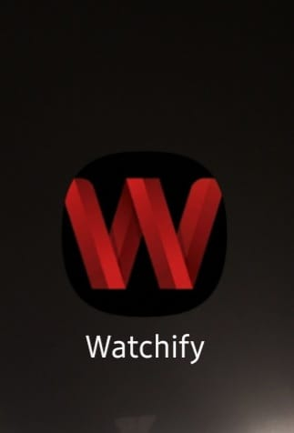

# 🎬 Watchify – React Native Movie App

Watchify is a modern **React Native + Expo** movie browsing application that allows users to explore trending movies, search films, and manage favorites in a clean and responsive UI.

---

## 🚀 Features

* 🎥 Browse trending and popular movies
* 🔍 Search movies by name
* ❤️ Add/remove favorites (real-time support if connected to backend)
* 📱 Clean and responsive mobile UI
* ⚡ Fast performance with React Native + Expo
* 🔗 API integration for movie data

---

## 🛠️ Tech Stack

* React Native
* Expo
* TypeScript
* Tailwind CSS (NativeWind)
* Axios (API calls)
* Firebase (authentication, database, and backend services)

---

## 📁 Project Structure

```
Watchify-react-native-app/
│
├── app/                # App screens (routing)
├── components/        # Reusable UI components
├── constants/         # App constants (icons, config)
├── context/           # Global state management
├── services/          # API calls (movies, backend)
├── interfaces/        # TypeScript types
├── assets/            # Images & icons
├── .expo/             # Expo config (ignored in git)
├── App.tsx            # Entry point
└── package.json
```

---

## ⚙️ Installation & Setup

### 1. Clone the repository

```bash
git clone https://github.com/Waseem-Muhammad/Watchify.git
cd Watchify-react-native-app
```

### 2. Install dependencies

```bash
npm install
```

### 3. Start development server

```bash
npx expo start
```

---

## 🔐 Environment Variables

Create a `.env` file in the root directory:

```env
EXPO_PUBLIC_MOVIE_API_KEY=your_tmdb_api_key

EXPO_PUBLIC_FIREBASE_API_KEY=your_firebase_api_key
EXPO_PUBLIC_FIREBASE_AUTH_DOMAIN=your_project.firebaseapp.com
EXPO_PUBLIC_FIREBASE_DATABASE_URL=your_database_url
EXPO_PUBLIC_FIREBASE_PROJECT_ID=your_project_id
EXPO_PUBLIC_FIREBASE_STORAGE_BUCKET=your_storage_bucket
EXPO_PUBLIC_FIREBASE_MESSAGING_SENDER_ID=your_sender_id
EXPO_PUBLIC_FIREBASE_APP_ID=your_app_id
```

⚠️ Do NOT commit `.env` to GitHub.

---

## 📦 APK Download

You can download and install the latest Android APK of Watchify here:

👉 **Download APK:** ([Click here to download APK File](https://expo.dev/accounts/mwaseemgc/projects/react-native-movie-app/builds/7a26d020-f1a7-4225-a371-d077d0b60546))


> After downloading, enable "Install from unknown sources" on your Android device.

---

## 🔨 Build APK

Using EAS:

```bash
eas build -p android
```

For clean build:

```bash
eas build -p android --clear-cache
```
---

## 🧠 Future Improvements

- Firebase Authentication
- Cloud sync for favorites
- Offline mode support
- Video streaming integration
- Dark/light theme toggle
- Push notifications
---

## 👩‍💻 Authors

**Muhammad Waseem**

**Yumna Arif**

**Isha Shabab**

GitHub: [Muhammad Waseem](https://github.com/Waseem-Muhammad)

GitHub: [Yumna Arif](https://github.com/Yumna-Arif)

GitHub: [Isha Shabab](https://github.com/Isha-Shabab)

---

## 📸 Screenshots

### 🚀 Opening Screen


### 🏠 Home Screen


### 🔍 Search Screen


### 🎬 Movie Details


### ❤️ Saved Movies


### 📱 App Icon


---

## 🤝 Contributing

Contributions, issues, and feature requests are welcome.

1. Fork the repository
2. Create a new branch
3. Commit your changes
4. Push to your branch
5. Open a Pull Request

---

## 🔒 Security Notice

This project uses environment variables for API keys and Firebase configuration.

Make sure to create your own `.env` file and never expose secret keys publicly.

---

## 📱 Platform Support

- Android ✅
- Web ✅

---

## ⚠️ Disclaimer

This project is developed for educational and portfolio purposes only.

Movie data is provided by TMDB API. All movie posters, titles, and related content belong to their respective owners.

---

## 🙌 Acknowledgements

- TMDB API
- Expo
- React Native
- Firebase

---
## ⭐ Show Support

If you like this project, consider giving it a ⭐ on GitHub!

---

## 📄 License

This project is developed for educational and portfolio purposes.
